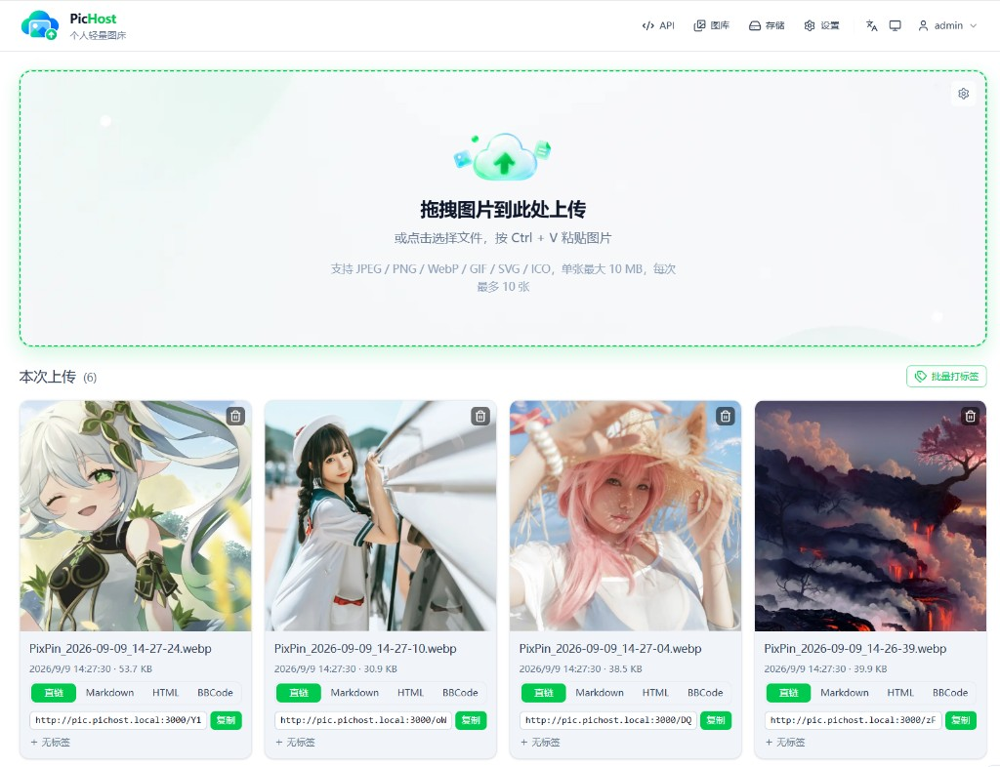
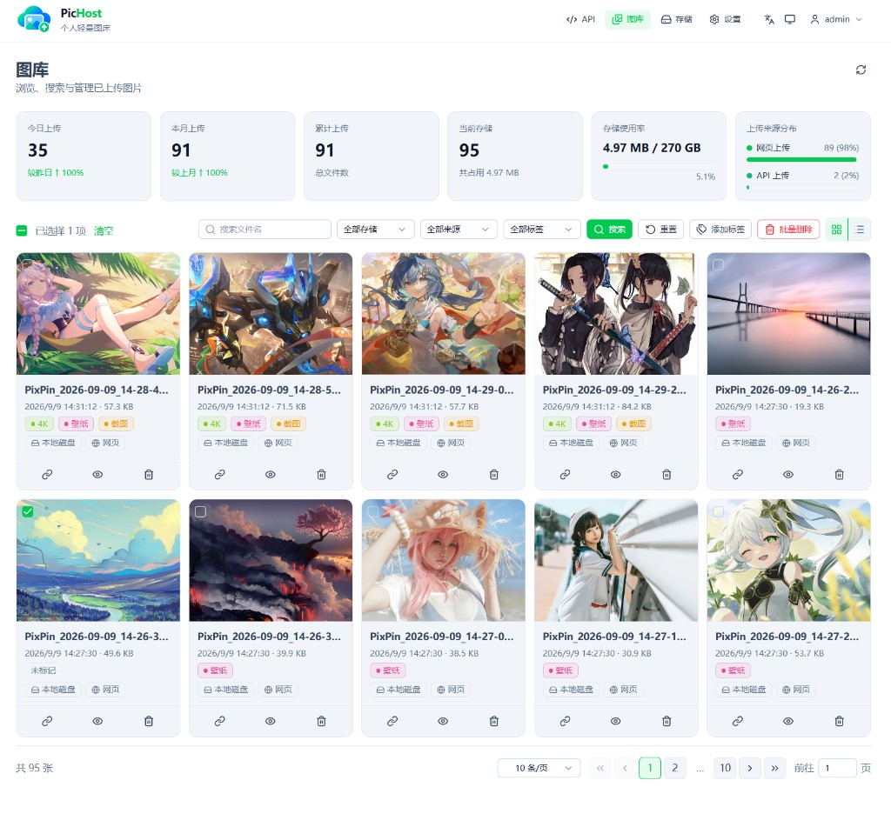
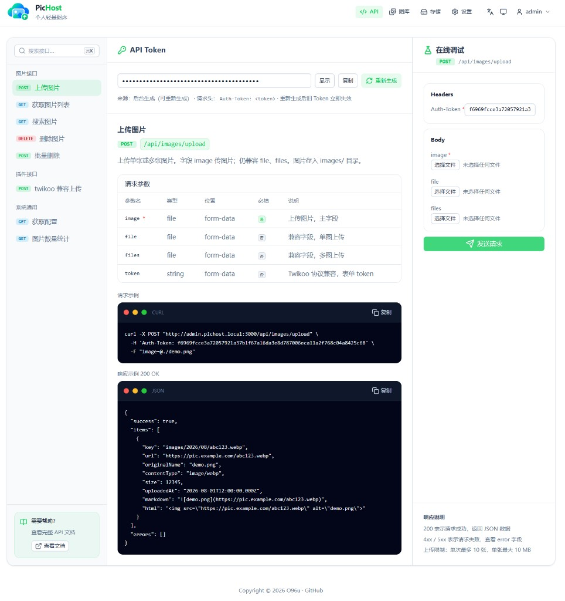
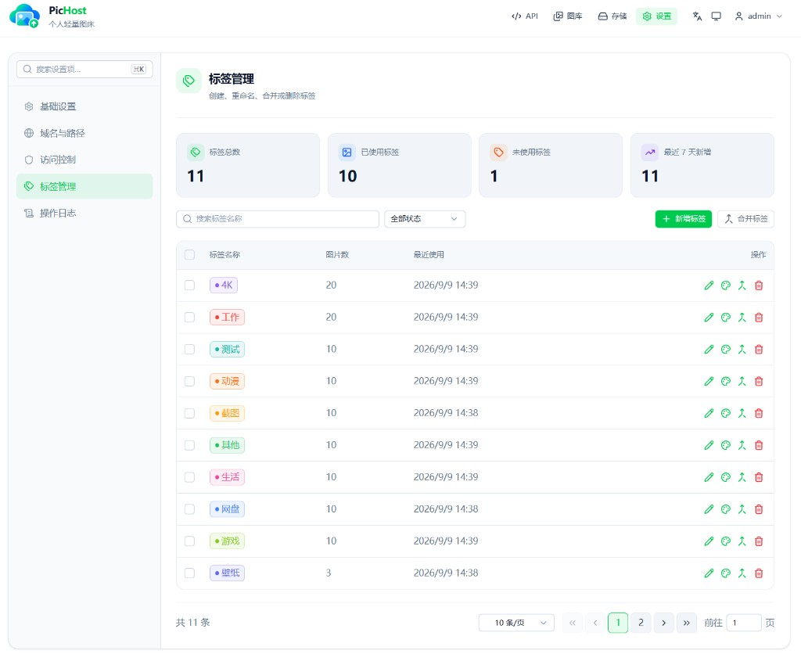
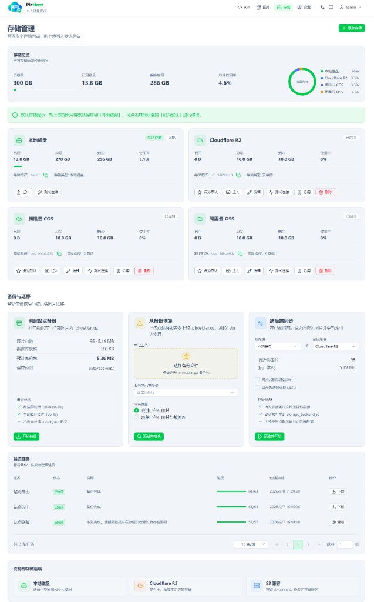
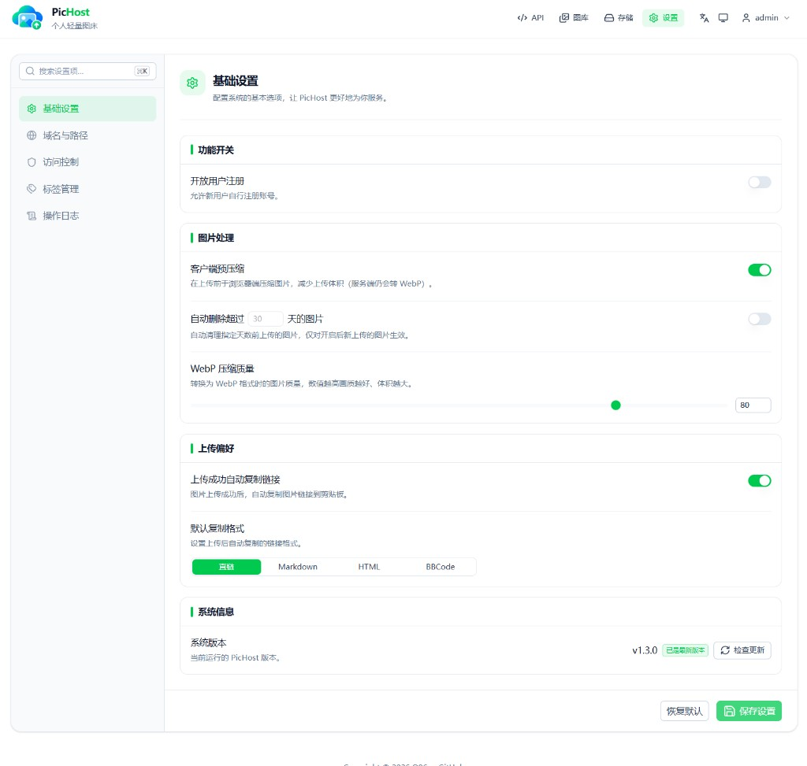
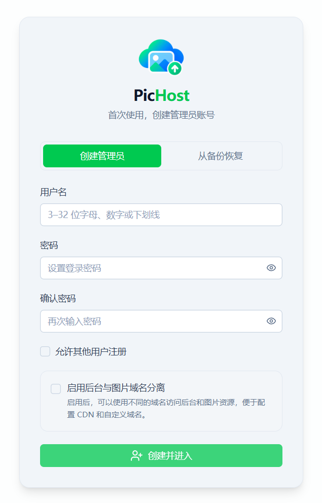
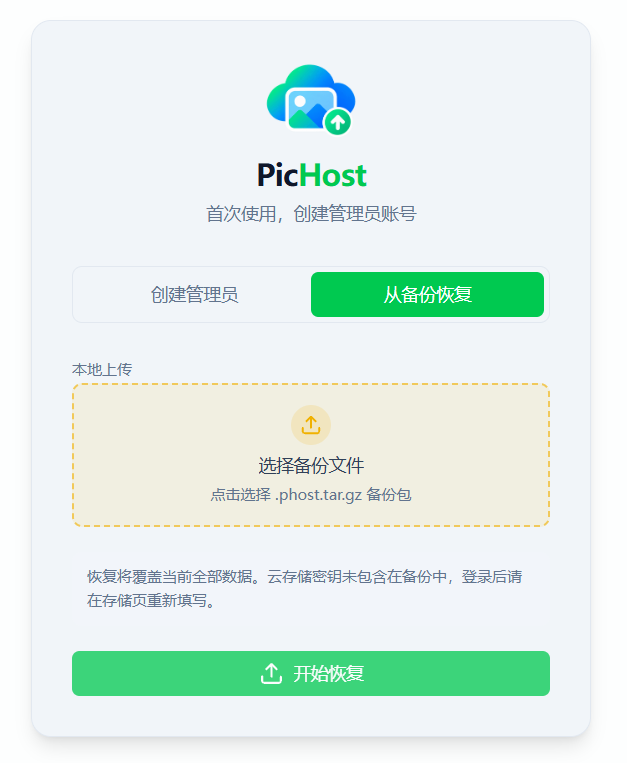

<p align="center">
  
</p>

<h1 align="center">Pic-Warehouse</h1>

<p align="center"><strong>Lightweight personal image hosting</strong> · Simple uploads, clean management</p>

<p align="center">Self-hosted / Multi-user / Docker / API / Twikoo · Local disk or object storage</p>

<p align="center">
  <a href="https://github.com/muxin-403/Pic-Warehouse/blob/main/package.json"></a>
  <a href="https://github.com/muxin-403/Pic-Warehouse/actions/workflows/ci.yml"></a>
  
  <a href="https://github.com/muxin-403/Pic-Warehouse/pkgs/container/pic-warehouse"></a>
  
</p>

<p align="center">
  <a href="https://muxin-403.github.io/Pic-Warehouse/en/">Docs</a> ·
  <a href="#screenshots">Screenshots</a> ·
  <a href="#features">Features</a> ·
  <a href="#tech-stack">Tech Stack</a> ·
  <a href="#quick-start">Quick Start</a> ·
  <a href="README.md">简体中文</a>
</p>

---

## Screenshots

**main** has no public demo. **cloudflare** branch live demo: [pic.roven.cc](https://pic.roven.cc)

| Upload | Gallery |
| :----: | :-----: |
|  |  |

| API | Tag management |
| :-: | :------------: |
|  |  |

| Storage | Settings |
| :-----: | :-------: |
|  |  |

| First-time setup | Restore from backup |
| :--------------: | :-----------------: |
|  |  |

| Activity log |
| :----------: |
|  |

## Features

- **Drag, click, or Ctrl+V paste** — server-side WebP, Referer hotlink protection
- **Multi-user** — login with slider, Turnstile, or Cap verification; optional registration; users see only their images
- **Multi-backend storage** — local disk + S3-compatible (R2 / COS / OSS / AWS) + WebDAV (Nextcloud / Koofr / Alist, etc.); hybrid `proxy` / `public` URLs
- **Gallery** — browse, search, filter by storage/source/tags, grid/list views, batch delete and batch tagging; stats overview and source breakdown; image detail modal with link formats
- **Tags** — per-user colored tags; tag on upload (single or batch); manage in Settings (create, recolor, merge, delete); API supports `tagIds` and batch tagging
- **Backup & migration** — full-site export/restore (`.phost.tar.gz`), cross-backend sync; restore from backup on uninitialized `/setup`
- **API & Twikoo** — global / per-user tokens; `POST /api/index.php` compatible
- **Zero-config Docker** — first-run web wizard, no secrets upfront

## Tech Stack

| Layer | Technologies |
| ----- | ------------ |
| Frontend | [Nuxt 4](https://nuxt.com) · [Nuxt UI 4](https://ui.nuxt.com) · [Vue 3](https://vuejs.org) · [Tailwind CSS 4](https://tailwindcss.com) · TypeScript |
| Backend | [Nitro](https://nitro.build) (`node-server`) · REST API |
| Data | SQLite · local `data/pichost.db` |
| Images | [sharp](https://sharp.pixelplumbing.com) (server-side WebP) |
| Storage | Local disk · S3-compatible ([AWS SDK](https://aws.amazon.com/sdk-for-javascript/) · R2 / COS / OSS, etc.) · WebDAV |
| i18n | [@nuxtjs/i18n](https://i18n.nuxtjs.org) (zh-CN / English) |
| Quality & docs | [Vitest](https://vitest.dev) · [VitePress](https://vitepress.dev) docs site |
| Deploy | Docker · Node.js 22 |

## Quick Start

```bash
docker run -d \
  --name pic-warehouse \
  -p 6892:6892 \
  -v ./data:/data \
  --restart unless-stopped \
  ghcr.io/muxin-403/pic-warehouse:latest
```

Open `http://<host>:6892` and complete the setup wizard.

**Full guide** (env vars, upgrades, dual-domain setup, API, Twikoo, reverse proxy, local dev, etc.): **[Documentation](https://muxin-403.github.io/Pic-Warehouse/en/)**.

| Branch | Notes |
| ------ | ----- |
| [**main**](https://github.com/muxin-403/Pic-Warehouse/tree/main) | Default: multi-backend, dual-domain, unified `images/` storage |
| [**cloudflare**](https://github.com/O96u/PicHost/tree/cloudflare) | Cloudflare R2 only; live demo [pic.roven.cc](https://pic.roven.cc) |

## License

[GPL-3.0](LICENSE)

## Friend links

[LINUX DO](https://linux.do/)
