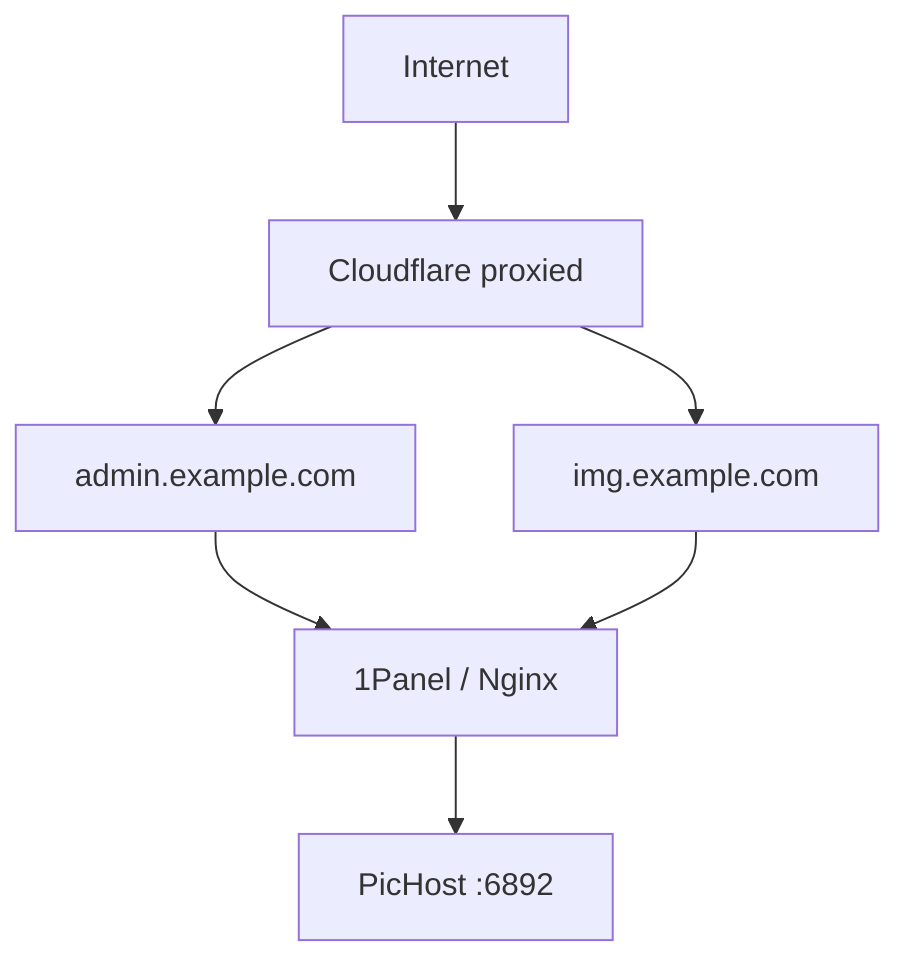

# Cloudflare & preferred-edge deployment

In dual-domain mode, PicHost distinguishes **site** vs **image** traffic from the request **Host** (and `X-Forwarded-Host` from a trusted reverse proxy). Cloudflare orange cloud, preferred-edge IPs, Workers, and Pages are all fine — as long as the hostname identity reaching PicHost stays correct.

> **One-line rule:** The network path may change; the hostname identity must not — `admin → admin`, `img → img`, never `img → admin`.

See [Dual-domain separation](./domain-separation.md) for middleware behavior and [Reverse proxy](./reverse-proxy.md) for general proxy requirements.

---

## Quick checklist

| # | Check | Expected |
| - | ----- | -------- |
| 1 | Browser hostname | `admin.*` or `img.*`; do not mix IP / `pages.dev` |
| 2 | Pages / Worker in the middle | Image host must **not** `fetch(admin…)` |
| 3 | Reverse-proxy upstream | Both hostnames → `http://127.0.0.1:6892` |
| 4 | Nginx `proxy_set_header Host` | `$host` (preserve client hostname) |
| 5 | PicHost settings | `SITE_BASE_URL` / `IMAGE_BASE_URL` match `server_name` |
| 6 | Port `6892` | Reachable only from localhost or internal proxy |

---

## Recommended layout

Both hostnames go through Cloudflare (proxied) and **independently** reverse-proxy to one PicHost instance:



```env
SITE_BASE_URL=https://admin.example.com
IMAGE_BASE_URL=https://img.example.com
```

```text
admin.example.com → http://127.0.0.1:6892
img.example.com   → http://127.0.0.1:6892
```

You do **not** need separate ports for “frontend / backend / images” — one PicHost instance on port `6892` is enough.

### Site hostname ≠ frontend domain

| Hostname | Serves |
| -------- | ------ |
| `admin.example.com` | Admin UI, login, settings, gallery, API, upload |
| `img.example.com` | Image delivery, hotlinks, CDN |

Use **site / image hostname**, not “frontend / backend”. PicHost does **not** require `frontend :3000 + backend :6892` in production.

---

## Orange cloud & preferred edge

**DNS Proxied (orange cloud)** is normal and recommended:

```text
admin.example.com, img.example.com
  A/CNAME → origin → Proxied
```

Opening `admin.example.com` should yield `Host: admin.example.com` at PicHost; `img.example.com` should yield `Host: img.example.com`.

**Preferred-edge** setups (alternate IPs, entry hostnames) are also fine. Preferred routing may change the path to Cloudflare’s edge, but must **not** rewrite the image hostname’s origin identity to the site hostname:

```text
admin → CF → admin.example.com → origin → PicHost
img   → CF → img.example.com   → origin → PicHost
```

---

## 6. Typical bad topologies

These patterns break Host isolation even when the browser still shows the image hostname:

### ❌ Bad 1: Image host fetches site host


The last hop has `Host: admin.example.com`, so PicHost treats it as site traffic — `https://img.example.com/` may show the admin UI. This is **Host rewrite**, not a cache bug.

### ❌ Bad 2: Preferred proxy upstreams to site host

```text
img.example.com → preferred hostname → admin.example.com → origin
```

Even for routing only, using the site hostname as upstream breaks image isolation.

### ❌ Bad 3: Public exposure of port 6892

```text
any host / IP:6892 → PicHost
```

Users can bypass Cloudflare and Nginx `server_name` rules. Port `6892` should be reachable only from `127.0.0.1` or an internal reverse proxy.

### ✅ Correct pattern

```text
admin → admin → PicHost
img   → img   → PicHost
```

Do **not** use Pages / Workers as a **full-site reverse proxy** for PicHost (extra `pages.dev` / `workers.dev` entry points). PicHost needs `node-server`, SQLite, `sharp`, and local `data/` — it **cannot** run as a Node app on Pages/Workers. Keep Docker/VPS for the app; use orange-cloud DNS and optional R2 on CF.

---

## Workers / Pages guidance

If you only need headers, auth, Referer rules, logging, or cache — and PicHost remains your origin:

| Prefer | Avoid |
| ------ | ----- |
| `img.example.com` → **Worker Route** → existing `img` origin | `img` → Worker → `fetch(admin.example.com)` |

Cloudflare recommends [Routes](https://developers.cloudflare.com/workers/configuration/routing/routes/) when an external origin already exists, rather than [Custom Domains](https://developers.cloudflare.com/workers/configuration/routing/custom-domains/) used to chain cross-host `fetch()`.

Code like this on the image hostname is a smoking gun:

```js
fetch(`https://admin.example.com${url.pathname}`)
```

---

## Nginx / 1Panel layout

Two `server` blocks, same upstream. Critical line: `proxy_set_header Host $host;`

```nginx
server {
    server_name admin.example.com;
    location / {
        proxy_pass http://127.0.0.1:6892;
        proxy_set_header Host $host;
        proxy_set_header X-Forwarded-Proto $scheme;
        proxy_set_header X-Real-IP $remote_addr;
        proxy_set_header X-Forwarded-For $proxy_add_x_forwarded_for;
        client_max_body_size 12m;
    }
}

server {
    server_name img.example.com;
    location / {
        proxy_pass http://127.0.0.1:6892;
        proxy_set_header Host $host;
        proxy_set_header X-Forwarded-Proto $scheme;
        proxy_set_header X-Real-IP $remote_addr;
        proxy_set_header X-Forwarded-For $proxy_add_x_forwarded_for;
    }
}

# Reject bare IP and unknown hostnames (strongly recommended)
server {
    listen 80 default_server;
    listen 443 ssl default_server;
    server_name _;
    return 444;
}
```

With orange cloud, restrict the origin firewall to **[Cloudflare IP ranges](https://www.cloudflare.com/ips/)** only.

---

## Two-layer Host protection

Use reverse proxy and application layers **together**:

| Layer | Role |
| ----- | ---- |
| **Nginx default server** | Reject bare IP, `pages.dev`, and other undeclared hostnames |
| **PicHost middleware (v1.2.x+)** | When dual-domain is on, unconfigured hosts get 404 at the app (`localhost` / `127.0.0.1` exempt in development) |

Even with app-layer blocking, keep a default server at the proxy to reduce junk traffic to PicHost.

---

## X-Forwarded-Host

PicHost may consult `X-Forwarded-Host` behind a reverse proxy, but that header is **forgeable** by clients. Therefore:

- Do not expose port `6892` publicly
- Only trusted proxies should reach the app
- Prefer keeping `Host` correct from the first hop

---

## Troubleshooting: admin UI on image hostname?

**Inspect the proxy chain first — do not purge CF cache first.**

Cache issues usually mean stale JS/CSS/images or occasional 404s. If `/`, `/login`, and `/settings` work **reliably** on the image host, the Host was almost certainly rewritten.

```text
① Browser hostname?
② Pages / Worker / preferred proxy in the middle?
③ What URL does the proxy fetch?
④ Does it fetch admin.example.com?
⑤ Which Host does 1Panel / PicHost see?
```

---

## Related

- [Dual-domain separation](./domain-separation.md)
- [Reverse proxy](./reverse-proxy.md)
- [Environment variables](./configuration.md)
- [FAQ](./faq.md)
