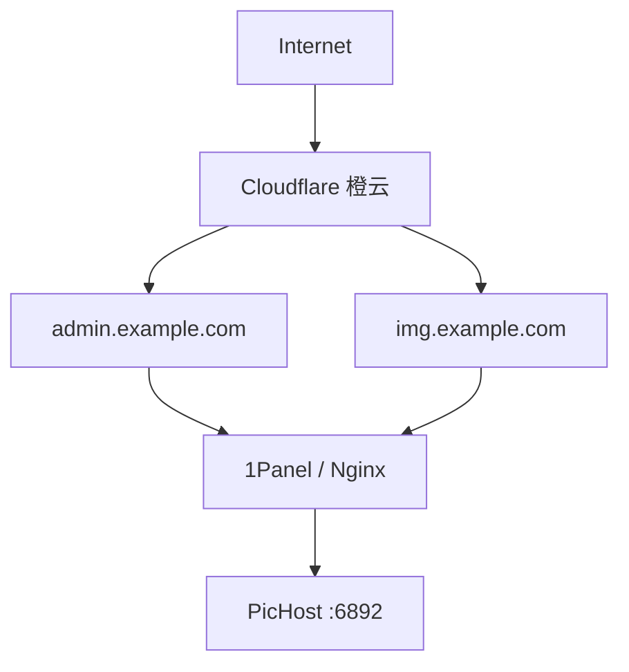
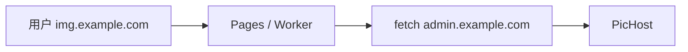

# Cloudflare / CF 优选部署说明

PicHost 双域名模式下，应用根据请求 **Host**（及可信反代转发的 `X-Forwarded-Host`）区分**管理域**与**图片域**。使用 Cloudflare 橙云、优选线路、Workers 或 Pages 时，只要最终到达 PicHost 的 Host 身份不变，即可正常工作。

> **一句话原则：** 网络线路可以改变，请求的域名身份不能改变 — `admin → admin`，`img → img`，不要 `img → admin`。

基础概念见 [双域名分离](./domain-separation.md)；反代通用要求见 [反向代理](./reverse-proxy.md)。

---

## 快速检查清单

部署或排错时，按顺序确认：

| # | 检查项 | 期望 |
| - | ------ | ---- |
| 1 | 浏览器地址栏域名 | `admin.*` 或 `img.*`，不要用 IP / `pages.dev` 混用 |
| 2 | 中间是否经过 Pages / Worker | 图片域**不得** `fetch(admin…)` |
| 3 | 反代 upstream | 两个域名均指向 `http://127.0.0.1:6892` |
| 4 | Nginx `proxy_set_header Host` | `$host`（保持客户端域名） |
| 5 | PicHost 设置 | `SITE_BASE_URL` / `IMAGE_BASE_URL` 与 `server_name` 一致 |
| 6 | 端口 `6892` | 仅本机或内网反代可达，不对公网裸露 |

---

## 推荐拓扑

两个域名经 Cloudflare（橙云）后，**各自独立**反代到同一 PicHost 实例：



```env
SITE_BASE_URL=https://admin.example.com
IMAGE_BASE_URL=https://img.example.com
```

```text
admin.example.com → http://127.0.0.1:6892
img.example.com   → http://127.0.0.1:6892
```

不需要为「前端 / 后端 / 图片」开不同端口；一个 PicHost 实例、一个内部端口（默认 `6892`）即可。

### 管理域 ≠ 前端域名

| 域名 | 用途 |
| ---- | ---- |
| `admin.example.com` | 后台、登录、设置、图库、API、上传 |
| `img.example.com` | 图片直链、外链、CDN 分发 |

更准确的说法是**管理域 / 图片域**，而非「前端 / 后端」。PicHost 生产环境也**不需要** `前端 :3000 + 后端 :6892` 这种拆分。

---

## Cloudflare 橙云与 CF 优选

**橙云（DNS Proxied）** 是正常且推荐的方式：

```text
admin.example.com、img.example.com
  A / CNAME → 源站 → Proxied
```

用户访问 `admin.example.com` 时，PicHost 应收到 `Host: admin.example.com`；访问 `img.example.com` 时应收到 `Host: img.example.com`。

**CF 优选**（优选 IP、优选域名、边缘入口）同样可用。优选可以改变用户到 Cloudflare 边缘的路径，但**不能**把图片域的回源身份变成管理域。两个域名应保持平行、独立的回源链：

```text
admin → CF → admin.example.com → 源站 → PicHost
img   → CF → img.example.com   → 源站 → PicHost
```

---

## 六、典型错误拓扑

以下方案会破坏 Host 隔离，即使浏览器地址栏仍显示图片域：

### ❌ 错误 1：图片域 fetch 到管理域



最后一跳 Host 变成 `admin.example.com`，PicHost 会认为这是管理域 — `https://img.example.com/` 可能看到后台。这是 **Host 被改写**，不是缓存问题。

### ❌ 错误 2：优选回源到管理域

```text
img.example.com → 优选域名 → admin.example.com → 源站
```

即使只为改善线路，只要 upstream 使用管理域，图片域隔离即失效。

### ❌ 错误 3：公网直接暴露 6892

```text
任意域名 / IP:6892 → PicHost
```

用户可绕开 Cloudflare 与 Nginx 的 `server_name` 限制。`6892` 应仅允许 `127.0.0.1` 或内网反代访问。

### ✅ 正确做法

```text
admin → admin → PicHost
img   → img   → PicHost
```

**不要** Pages / Workers **整站反代** PicHost（会多出 `pages.dev` / `workers.dev` 等第三入口）。PicHost 依赖 `node-server`、SQLite、`sharp` 与本地 `data/`，**不能**作为 Node 应用直接部署到 Pages/Workers；应用本体继续 Docker/VPS 部署，CF 侧用橙云 DNS + 可选 R2 即可。

---

## Workers / Pages 使用建议

若只需改响应头、鉴权、防盗链、日志或缓存，且源站仍是自己的 PicHost：

| 推荐 | 不推荐 |
| ---- | ------ |
| `img.example.com` → **Worker Route** → 原 `img` 源站 | `img` → Worker → `fetch(admin.example.com)` |

Cloudflare 对已有外部源站的场景更推荐 [Routes](https://developers.cloudflare.com/workers/configuration/routing/routes/)（在现有 proxied 域名与源站之前运行），而非用 [Custom Domain](https://developers.cloudflare.com/workers/configuration/routing/custom-domains/) 把 Worker 当作跨域 fetch 的中转。

Worker 中若出现：

```js
fetch(`https://admin.example.com${url.pathname}`)
```

即基本可确定隔离被破坏。

---

## Nginx / 1Panel 配置

两个 `server` 块，upstream 相同，**关键行**是 `proxy_set_header Host $host;`：

```nginx
server {
    server_name admin.example.com;
    location / {
        proxy_pass http://127.0.0.1:6892;
        proxy_set_header Host $host;
        proxy_set_header X-Forwarded-Proto $scheme;
        proxy_set_header X-Real-IP $remote_addr;
        proxy_set_header X-Forwarded-For $proxy_add_x_forwarded_for;
        client_max_body_size 12m;
    }
}

server {
    server_name img.example.com;
    location / {
        proxy_pass http://127.0.0.1:6892;
        proxy_set_header Host $host;
        proxy_set_header X-Forwarded-Proto $scheme;
        proxy_set_header X-Real-IP $remote_addr;
        proxy_set_header X-Forwarded-For $proxy_add_x_forwarded_for;
    }
}

# 拒绝裸 IP 与未配置域名（强烈建议）
server {
    listen 80 default_server;
    listen 443 ssl default_server;
    server_name _;
    return 444;
}
```

橙云部署时，源站防火墙建议**仅放行 [Cloudflare IP 段](https://www.cloudflare.com/ips/)**，避免绕过 CDN 直连。

---

## 双层 Host 防护

生产环境建议反代层与应用层**互补**，而非二选一：

| 层级 | 作用 |
| ---- | ---- |
| **Nginx default server** | 拒绝裸 IP、`pages.dev` 等未在 `server_name` 中声明的 Host |
| **PicHost 中间件（v1.2.x+）** | 双域名开启时，非 site/image 的 Host 应用层返回 404（开发环境 `localhost` / `127.0.0.1` 例外） |

即使应用层已拦截第三 Host，仍建议在反代配置 default server — 减少无效流量到达 PicHost。

---

## X-Forwarded-Host 说明

PicHost 在反代场景会参考 `X-Forwarded-Host` 识别请求域名，但**不能无条件信任**该 Header（客户端可伪造）。因此：

- 不要让 `6892` 对公网裸露
- 确保只有可信反代能到达应用
- 首选方案仍是让 `Host` 从第一跳起就保持正确

---

## 排查：图片域能看到后台？

**先查反代链，不要先清 CF 缓存。**

缓存问题通常表现为旧 JS/CSS/图片或偶发 404；若图片域能**稳定**访问 `/`、`/login`、`/settings`，几乎都是 Host 被改写。

```text
① 浏览器实际域名？
② 是否经过 Pages / Worker / 优选反代？
③ 代理最终 fetch 的 URL？
④ 是否 fetch 到 admin.example.com？
⑤ 1Panel / PicHost 最终收到的 Host？
```

---

## 相关

- [双域名分离](./domain-separation.md) — 中间件行为与本地测试
- [反向代理](./reverse-proxy.md) — 单域名与源站加固
- [环境变量](./configuration.md) — `SITE_BASE_URL`、`IMAGE_BASE_URL`
- [常见问题](./faq.md) — Pages / Workers 与第三 Host
